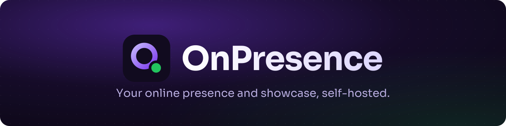
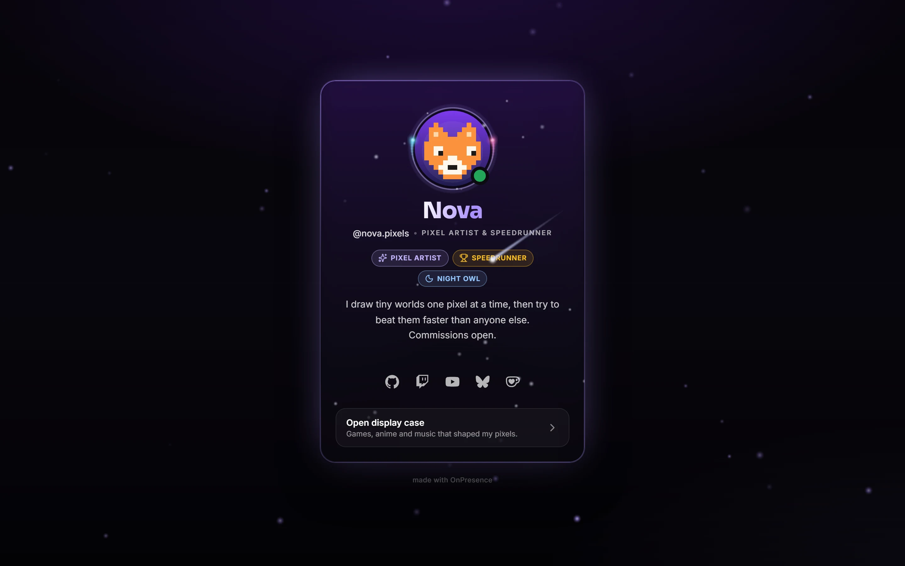
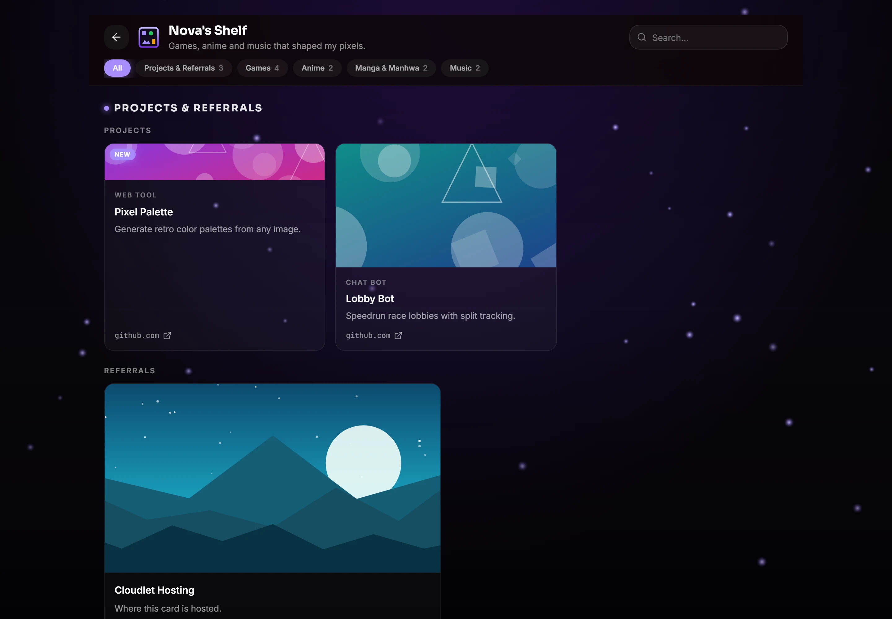
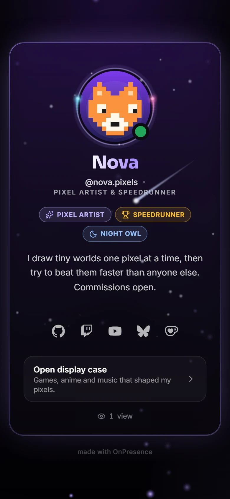
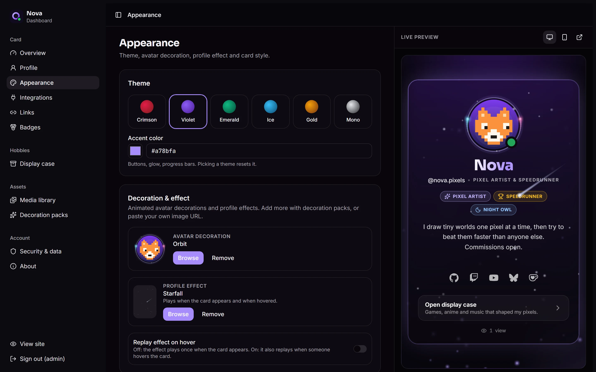
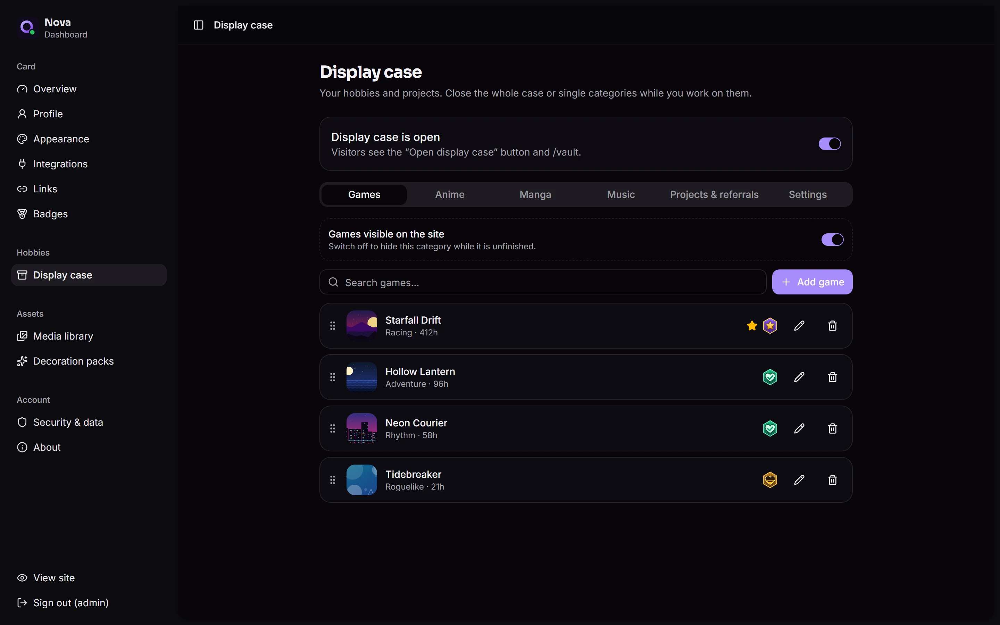

<p align="center">
  
</p>

<p align="center">
  
</p>

# OnPresence

**Your online presence and showcase, self-hosted.** A profile card in the style of guns.lol, plus a display case for your hobbies: games, anime, manga, music, and your own projects. One small binary, one SQLite file, and a dashboard to edit everything.

- **Profile card**: **animated avatar decorations** and **profile effects** (with importable packs), themes, fonts, name logos, badges, links, background video, soundtrack, entry screen, and a 3D tilt.
- **Live presence**: Discord status and activity (via [Lanyard](https://github.com/Phineas/lanyard)), Spotify, YouTube Music, **Last.fm now playing**, and Steam.
- **Display case**: games (Steam/SteamDB import), anime and manga (AniList import), playlists (Spotify/YouTube import), projects and referral codes. You can hide each section on its own.
- **Dashboard**: live preview, media library, first-run setup, **two-factor login (TOTP)**, profile history, JSON export/restore, and daily backups.
- **Small and private**: Go + SQLite, about 60 KB of JavaScript on the public page, no tracking, no external database.

## Screenshots

| Display case | Mobile |
|---|---|
|  |  |

| Dashboard with live preview | Display case editor |
|---|---|
|  |  |

The screenshots use the demo persona in [`docs/demo/demo-content.json`](docs/demo/demo-content.json). Load it on your own install under **Dashboard → Security & data → Restore from JSON** to see every feature filled in.

## Quick start

Docker:

```bash
docker run -d --name onpresence -p 8080:8080 -v onpresence-data:/app/data ghcr.io/itsissei/onpresence:latest
docker logs onpresence        # copy the setup code
```

Open `http://localhost:8080/admin`, enter the setup code, and create your account. Your card is at `http://localhost:8080/`.

No Docker? Download the binary for your OS from [Releases](../../releases), run `./onpresence`, and open the same URL.

For a real domain with HTTPS, see **[docs/install.md](docs/install.md)**. It has ready-made setups for Caddy (easiest), Traefik, nginx, and systemd.

## Documentation

| | |
|---|---|
| [Install & update](docs/install.md) | Docker, Compose, reverse proxies, binaries, backups, upgrades |
| [Configuration](docs/configuration.md) | Every environment variable |
| [Decoration packs](docs/decoration-packs.md) | Built-in decorations and effects, the pack format, making your own |
| [Development](docs/development.md) | Architecture, local setup, conventions |
| [Security policy](SECURITY.md) | Reporting vulnerabilities |

## Roadmap

- Smaller animated decorations and effects (animated WebP).
- Passkeys (WebAuthn) as a second factor.
- More languages for the public page (English only today).
- Multiple profiles on one install.
- Widget system for vault and custom categories.

Bug reports are welcome. Pull requests are not accepted for now; see [CONTRIBUTING.md](CONTRIBUTING.md).

## License

[MIT](LICENSE). Discord, Spotify, Steam, Last.fm and AniList are trademarks of their owners. OnPresence is not affiliated with them. The bundled decorations, effects and demo artwork are original and MIT licensed like the code.
